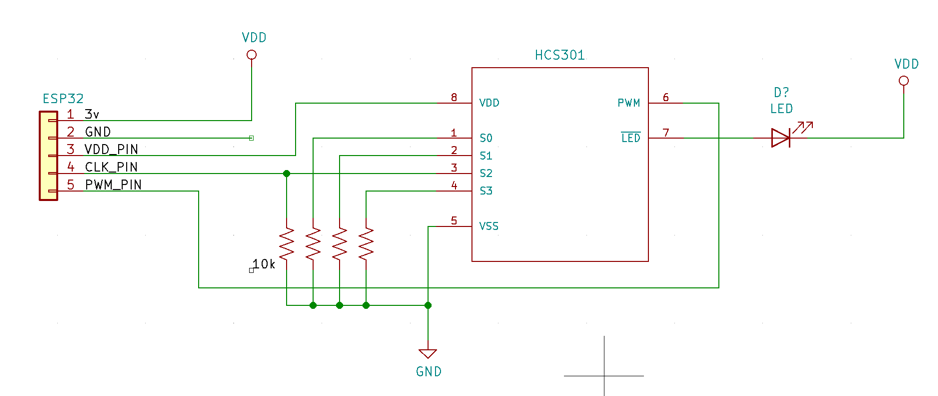
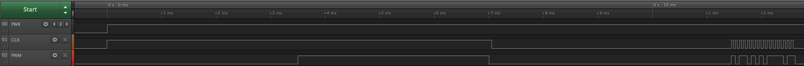
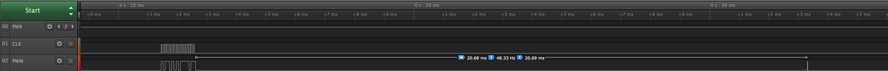
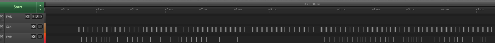

# Programming HCS301/KeeLoq devices

Example [arduino sketch](hcs301_programming/hcs301_programming.ino) for programming an HCS301/KeeLoq device using a ESP32. This is just an example and the code is intended to be integrated however someone sees fit... However, it would be very unwise to use an HCS301 or other KeeLoq ICs in a modern device.

## ESP32/Display Config

I chose to use an esp32 for this, with an integrated OLED display, because it was laying around. Initially I had some issues with programming, and I believe it was related to not grounding the pins as documented in the data sheet (DOH!).

## Circuit example

## Programming Device

On startup, the device must enter programming mode, then you send 12 words to configure the HCS controller. Once it enters programming mode it will wipe the device, so there is a bit of a delay. Below are some example logic analyzer captures using a saleae device.

After a successful word has been sent, the device sends an ack.

After sending all 12 words to the EEPROM, you can clock the S2 line and verify what you wrote to the EEPROM. This can only be done once and is stored in the vbuffer array in the example code.

